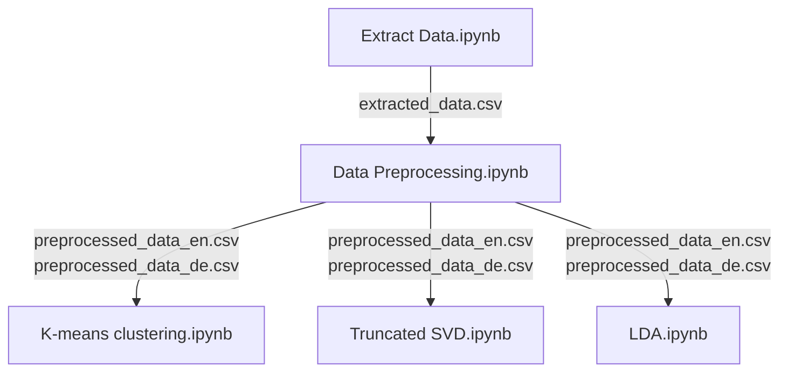

# Project for ML_Winfo_Praktikum_SS21

## Project Abstract
In this project, we implemented unsupervised machine learning algorithms in order to discover features in tickets text data, and achieved good results, finally providing clues for future simplification of the tickets system.

## Repository Structure
```bash
.
├── tickets
│   ├── *.csv (All specific tickets)
│   ├── tickets.csv
│   ├── status_log.csv
├── LDA.ipynb
├── Group 2 Final Presentation.pptx
├── Detailed Report of Group 2.pdf
├── Summary Report of Group 2.pdf
├── Extract Data.ipynb
├── Data Preprocessing.ipynb
├── Truncated SVD.ipynb
├── K-means clustering.ipynb
├── README.md
├── requirements.txt
└── .gitignore
```

## Setup

This project requires [Jupyter Notebook](https://jupyter.org/) to run.  Make sure that Jupyter Notebook is properly installed before the next steps.

Because of data protection, we cannot share data. Please put the tickets and related raw data in the specified folder `tickets`.

In your Command Prompt navigate to your project:
```sh
cd the_path_project_folder
```

Within the project, install the dependencies :
```sh
pip install -r requirements.txt
```

Run jupyter notebook and open the file within the jupyter notebook:
```sh
jupyter notebook
```

## Workflow
The structure of the project will produce a flow chart:


## File Explanation
- ```Detailed Report of Group 2.pdf```: This document describes in detail the process of our project including problem analysis, data processing, model building, results and discussion, etc.
-  ```Summary Report of Group 2.pdf```: Project summary, only the most important information is included, please refer to ```Detailed Report of Group 2.pdf``` for details.
- ```Extract Data.ipynb```: This file extracts the text we need from the raw tickets data.
- ```Data Preprocessing.ipynb```:   This notebook will accept the output text after the ``extract_data.ipynb`` run and will preprocess the text and split it into German (`preprocessed_data_de.csv`) and English (`preprocessed_data_en.csv`) text according to the text language.
- ```Truncated SVD.ipynb```:  This notebook will use the Truncated SVD algorithm to extract text-related topics.
- ```K-means clustering.ipynb```: This notebook will use the K-means clustering algorithm to cluster the preprocessed text and display the results on a 2-dimensional image using the umap algorithm.
- ```LDA.ipynb```:  Possible future work on preprocessed data using LDA (not a major part of the project).
-  ```Group 2 Final Presentation.pptx```:  The final presentation of Group 2.

## Algorithm

this project uses a number of algorithms to work properly:

| Algorithm | Website |
| ------ | ------ |
| TF-IDF | [tfidfvectorizer] |
| K-Means clustering | [KMeans] |
| Truncated SVD | [TruncatedSVD] |
| UMAP | [umap] |
| LDA |  [LatentDirichletAllocation]  |

## License

MIT

[//]: # (These are reference links used in the body of this note and get stripped out when the markdown processor does its job. There is no need to format nicely because it shouldn't be seen. Thanks SO - http://stackoverflow.com/questions/4823468/store-comments-in-markdown-syntax)
    
   [tfidfvectorizer]: <https://scikit-learn.org/stable/modules/generated/sklearn.feature_extraction.text.TfidfVectorizer.html>
   [KMeans]: <https://scikit-learn.org/stable/modules/generated/sklearn.cluster.KMeans.html>
   [umap]: <https://umap-learn.readthedocs.io/en/latest/>
   [TruncatedSVD]: <https://scikit-learn.org/stable/modules/generated/sklearn.decomposition.TruncatedSVD.html>
   [LatentDirichletAllocation]: <https://scikit-learn.org/stable/modules/generated/sklearn.decomposition.LatentDirichletAllocation.html>
